## 思考题

查询工资比Jones工资高的员工信息？

    select * from emp 
    where sal > (select sal from emp where ename in 'JONES');

 

查询工资最低的员工姓名？

    select ename from emp
    where sal = (select min(sal) from emp);

 

## 练习一
1. 查询入职日期最早的员工姓名，入职日期

```
select ename,hiredate

from emp 

where hiredate = (select min(hiredate) from emp);
```

 

2. 查询工资比SMITH工资高并且工作地点在CHICAGO的员工姓名，工资，部门名称

```
select ename,sal,dept.dname

from emp join dept

on emp.deptno = dept.deptno

where sal > 

(select sal from emp where ename in 'SMITH') 

and dept.loc in 'CHICAGO';

```

  

3. 查询入职日期比20部门入职日期最早的员工还要早的员工姓名，入职日期

```
一种解法：

select ename,hiredate

from emp

where hiredate < 

(select min(hiredate) from emp group by deptno having deptno in 20);


另一种解法：

select ename,hiredate

from emp

where hiredate < 

(select min(hiredate) from emp where deptno in 20);
```

    

4. 查询部门人数大于所有部门平均人数的的部门编号，部门名称，部门人数
```

select dept.deptno,dept.dname,count(emp.deptno)

from emp join dept

on emp.deptno = dept.deptno

group by dept.deptno,dept.dname

having count(emp.deptno) > 

(select avg(count(deptno)) from emp group by deptno);
```

  

## 练习二

1. 查询入职日期比10部门任意一个员工晚的员工姓名、入职日期，不包括10部门员工

```
select ename,hiredate

from emp

where hiredate > 

any (select hiredate from emp where deptno in 10) 

and deptno <> 10;
```


 

2. 查询入职日期比10部门所有员工晚的员工姓名、入职日期，不包括10部门员工

```
select ename,hiredate

from emp

where hiredate > 

all (select hiredate from emp where deptno in 10)

and deptno <> 10;
```

 

3. 查询职位和10部门任意一个员工职位相同的员工姓名，职位，不包括10部门员工

```
select ename,job

from emp

where job =

any (select job from emp where deptno in 10)

and deptno <> 10;
```

  

## 练习三
1. 查询职位及经理和10部门任意一个员工职位及经理相同的员工姓名，职位，不包括10部门员工
```

select ename,job

from emp

where (job,mgr) in 

(select job,mgr from emp where deptno in 10)

and deptno not in 10;
```

   

2. 查询职位及经理和10部门任意一个员工职位或经理相同的员工姓名，职位，不包括10部门员工

```
select ename,job

from emp

where job in 

(select job from emp where deptno in 10)

or mgr in

(select mgr from emp where deptno in 10)

and deptno not in 10;
```


    

## 练习四

1. 查询比自己职位平均工资高的员工姓名、职位，部门名称，职位平均工资
```
此题我不熟练，建议重复练习

select ename,emp.job,dname,avgSal

from emp,

(select job,avg(sal) avgSal from emp group by job) tabjob,

dept

where emp.job = tabjob.job 

and emp.deptno = dept.deptno 

and avgSal < sal;
```
  
    
      

2. 查询职位和经理同员工SCOTT或BLAKE完全相同的员工姓名、职位，不包括SCOOT和BLAKE本人。
```

select ename,job

from emp

where (job,mgr) in (select job,mgr from emp where ename in ('SCOTT','BLAKE'))

and ename not in ('SCOTT','BLAKE');
```

   

3. 查询不是经理的员工姓名。

```
select ename 

from emp

where empno not in 

(select nvl(mgr,0) from emp);
```


   

#### 此处要特别注意只要 (select mgr from emp) 语句返回只要有一条空则
#### 则会导致主查询没有记录返回。这是因为所有的条件和空值比较结果都是空值。因此无论
#### 什么时候只要空值有可能成为子查询结果集合中的一部分，就不能使用NOT IN 运算符
#### 切记！切记！！否则最终会害死自己和同事还有公司的！！！！！！


## 练习五
1. 查询入职日期最早的前5名员工姓名，入职日期。
```
select ename,hiredate 
from (select * from emp order by hiredate asc)
where rownum <= 5;
```

   


2. 查询工作在CHICAGO并且入职日期最早的前2名员工姓名，入职日期。

```
select ename,hiredate

from (select ename,hiredate 

from emp,dept 

where emp.deptno = dept.deptno 

and loc in 'CHICAGO' 

order by hiredate asc)

where rownum <= 2;


第二种解法：

select emp.ename,emp.hiredate

from emp join dept

on emp.deptno = dept.deptno

where dept.loc in 'CHICAGO' and rownum <= 2

order by hiredate;
```

   

## 练习六
1. 按照每页显示5条记录，分别查询第1页，第2页，第3页信息，要求显示员工姓名、入职日期、部门名称。
```
第一页

select ename,hiredate,dname

from (select ename,hiredate,dname,rownum rn

from emp join dept 

on emp.deptno = dept.deptno where rownum < 6 )

where rn > 0;
```
   

```
第二页

select ename,hiredate,dname

from (select ename,hiredate,dname,rownum rn 

from emp join dept 

on emp.deptno = dept.deptno where rownum < 11 )

where rn > 5;
```
   

```
第三页

select ename,hiredate,dname

from (select ename,hiredate,dname,rownum rn

from emp join dept 

on emp.deptno = dept.deptno where rownum < 16 )

where rn > 10;
```

 

## 练习七
1. 按照每页显示5条记录，分别查询工资最高的第1页，第2页，第3页信息，要求显示员工姓名、入职日期、部门名称、工资。

```
-- 第一步：将其所有的结果查出
select ename,hiredate,dname,sal
from emp,dept
where emp.deptno = dept.deptno
order by sal desc;
-- 第二步：将第一步的结果作为一个表再次进行查询,
--将将伪列重命名为一个列，此表可以作为制最大数值的表

select rownum rn tab_allDate.* from 
(select ename,hiredate,dname,sal
from emp,dept
where emp.deptno = dept.deptno
order by sal desc) tab_allDate;
-- 比如此处可以添一句where rownum <= maxNum 
-- 而若想分页则可以将以上的集合再判断 rn > minNum


-- 第三步：以上结果再次作业一个表进行分页

-- 第一页：0~5
select * from
(select rownum rn,tab_allDate.* from 
(select ename,hiredate,dname,sal
from emp,dept
where emp.deptno = dept.deptno
order by sal desc) tab_allDate
where rownum <= 5)
where rn > 0;

--第二页：5~10
select * from
(select rownum rn,tab_allDate.* from 
(select ename,hiredate,dname,sal
from emp,dept
where emp.deptno = dept.deptno
order by sal desc) tab_allDate
where rownum <= 10)
where rn > 5;
-- 第三页: 11~15
select * from
(select rownum rn,tab_allDate.* from 
(select ename,hiredate,dname,sal
from emp,dept
where emp.deptno = dept.deptno
order by sal desc) tab_allDate
where rownum <= 15)
where rn > 10;
```


## 课后作业
1. 查询工资高于编号为7782的员工工资，并且和7369号员工从事相同工作的员工的编号、姓名及工资。

```
select empno,ename,sal,job
from emp 
where sal > (select sal from emp where empno in 7782)
and job in (select job from emp where empno in 7369);
```


2. 查询工资最高的员工姓名和工资。 

```
select ename,sal
from emp
where sal in (select max(sal) from emp);
```


3. 查询部门最低工资高于10号部门最低工资的部门的编号、名称及部门最低工资。

```
--第一步：查询部门最低工资
select emp.deptno,dname,min(sal) from emp,dept
where emp.deptno = dept.deptno;
--第二步：查询10号部门的最低工资
select min(sal) from emp where deptno in 10;
--第三步：解题

--第一种 解题方式：
select emp.deptno,dname,min(sal) from emp,dept
where emp.deptno = dept.deptno
group by emp.deptno,dname --group by是所有列必须出现在后边
having min(sal) > (select min(sal) from emp where deptno in 10);
--第二种 解题方式：
select tab_minSal_gb_deptno.deptno,dname,tab_minSal_gb_deptno.minSal_by_deptno
from (select min(sal) minSal_by_deptno,deptno from emp group by deptno) tab_minSal_gb_deptno,
(select min(sal) minSal_deptno10 from emp where deptno in 10),dept
where tab_minSal_gb_deptno.deptno = dept.deptno 
and minSal_by_deptno > minSal_deptno10;
```

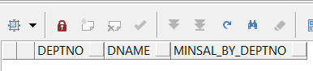

4. 查询员工工资为其部门最低工资的员工的编号和姓名及工资。

```
--第一步：先查部门的最低工资
select deptno,min(sal) from emp group by deptno;
--第二步：将上面的结果集作为一个表，进行多表查询
select empno,ename,sal 
from emp,(select deptno,min(sal) minSal_gb_deptno from emp group by deptno) tab_minSal_gb_deptno
where emp.deptno = tab_minSal_gb_deptno.deptno
and sal = minSal_gb_deptno;
```
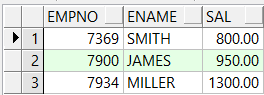

5. 显示经理是KING的员工姓名，工资。

```
--第一步：先查出KING的员工编号
select empno from emp where ename in 'KING';
--第二步：解题 
select ename,sal
from emp
where mgr in (select empno from emp where ename in 'KING')
```
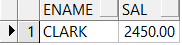

6. 显示比员工SMITH参加工作时间晚的员工姓名，工资，参加工作时间。

```
--第一步：先查出SMITH参加工作的时间
select hiredate from emp where ename in 'SMITH';
--第二步：解题 
select ename,sal,hiredate
from emp
where hiredate > (select hiredate from emp where ename in 'SMITH');
```
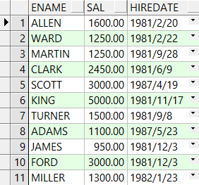

7. 使用子查询的方式查询哪些职员在NEW YORK工作。

```
select * from emp,dept
where emp.deptno in dept.deptno
and loc in 'NEW YORK';
```
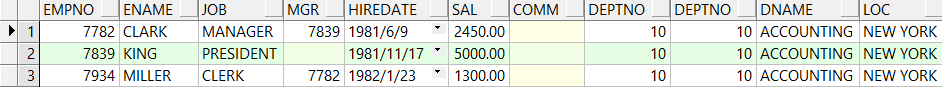

8. 写一个查询显示和员工SMITH工作在同一个部门的员工姓名，雇用日期，查询结果中排除SMITH。

```
select ename,hiredate
from emp,dept
where emp.deptno in dept.deptno
and emp.deptno in (select deptno from emp where ename in 'SMITH')
and ename not in 'SMITH';
```
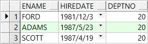

9. 写一个查询显示其工资比全体职员平均工资高的员工编号、姓名。

```
select empno,ename
from emp
where sal > (select avg(sal) from emp);
```
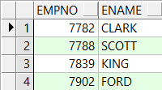


10. 写一个查询显示其上级领导是King的员工姓名、工资。

```
select ename,sal
from emp
where mgr in (select empno from emp where ename in 'KING');
```
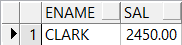

11. 显示所有工作在RESEARCH部门的员工姓名，职位。

```
select ename,job
from emp,dept
where emp.deptno in dept.deptno
and dname in 'RESEARCH';
```

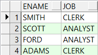

12. 查询每个部门的部门编号、平均工资，要求部门的平均工资高于部门20的平均工资。

```
--第一步：查询第个部门的部门编号，平均工资
select deptno,avg(sal) avgSal_gb_deptno
from emp
group by deptno;
--第二步：查询部门20的平均工资
select deptno,avg(sal) avgSal_gb_deptno_20
from emp
group by deptno
having deptno in 20;
--第三步：解题 
select deptno,avg(sal)
from emp
group by deptno
having avg(sal) > 
(select avg(sal)
from emp
group by deptno
having deptno in 20);
```

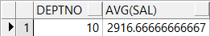

13. 查询大于自己部门平均工资的员工姓名，工资，所在部门平均工资，高于部门平均工资的额度。

```
--第一步：查询自己部门的平均工资
select deptno,avg(sal) from emp group by deptno;
--第二步：将以上结果作为一个表进行多表查询

select ename,sal,avgSal_gb_deptno,(sal - avgSal_gb_deptno) 高于平均工资的差值
from emp,
(select deptno,avg(sal) avgSal_gb_deptno from emp group by deptno) tab_gb_deptno
where emp.deptno in tab_gb_deptno.deptno
and sal > avgSal_gb_deptno;
```
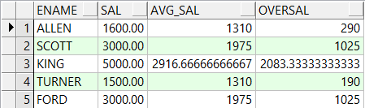

14. 列出至少有一个雇员的所有部门

```
select deptno,count(1)
from emp
group by deptno
having count(*) > 0;
```
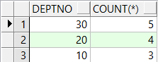

15. 列出薪金比"SMITH"多的所有雇员

```
select * from emp
where sal > (select sal from emp where ename in 'SMITH');
```
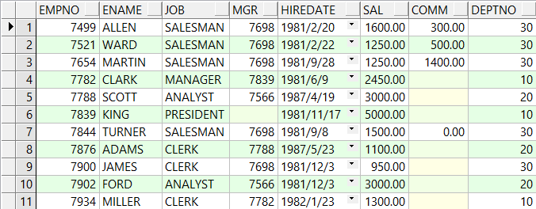

16. 列出入职日期早于其直接上级的所有雇员

```
select worker.ename,worker.hiredate
from emp worker,emp manager
where worker.mgr in manager.empno
and worker.hiredate < manager.hiredate;
```
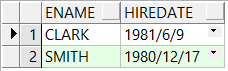

17. 找员工姓名和直接上级的名字

```
select worker.ename 员工姓名,manager.ename 直接上级姓名
from emp worker,emp manager
where worker.mgr in manager.empno(+);
```
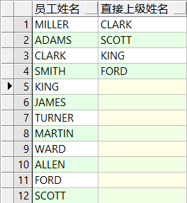


18. 显示部门名称和人数

```
--第一步：先查出部门人数
select count(*) countNum,deptno
from emp
group by deptno;
--第二步：以上面的查询结果作一个表，多表查询
select dname,countNum
from dept,(
select count(*) countNum,deptno
from emp
group by deptno) tab_countNum_gb_deptno
where dept.deptno in tab_countNum_gb_deptno.deptno(+);
```

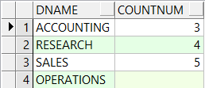

19. 显示每个部门的最高工资的员工

```
select ename,sal,deptno
from emp
where sal in
(select max(sal) from emp group by deptno);
```

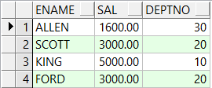

20. 显示出和员工号7369部门相同的员工姓名，工资

```
select ename,sal 
from emp
where deptno in (select deptno from emp where empno in 7369);
```
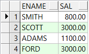

21. 显示出和姓名中包含"W"的员工相同部门的员工姓名

```
--第一步：先查出姓名中包含"W"的员工部门
select deptno from emp where ename like '%W%';
--第二步：解题 
select ename
from emp 
where deptno in
 (select deptno from emp where ename like '%W%')
```

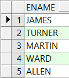

22. 显示出工资大于平均工资的员工姓名，工资

```
select ename,sal
from emp 
where sal > (select avg(sal) from emp);
```

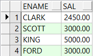

23. 显示出工资大于本部门平均工资的员工姓名，工资

```
--第一步：查询本部门的平均工资
select avg(sal),deptno from emp group by deptno;
--第二步：解题
select ename,sal
from emp,(select avg(sal) avgSal_gb_deptno,deptno from emp group by deptno) tab_avgSal_gb_deptno
where emp.deptno in tab_avgSal_gb_deptno.deptno
and sal > avgSal_gb_deptno;
```
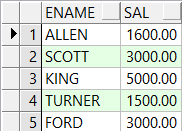

24. 显示每位经理管理员工的最低工资，及最低工资者的姓名

```
--第一步：先查出每位经理管理的员工的最低工资
select min(sal),mgr from emp where mgr is not null group by mgr;
--第二步：解题 
select sal,ename
from emp,(select min(sal) minSal,mgr from emp where mgr is not null group by mgr) tab_minSal_gb_mgr
where emp.mgr in tab_minSal_gb_mgr.mgr
and sal in minSal;
```
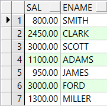

25. 显示比工资最高的员工参加工作时间晚的员工姓名，参加工作时间

```
select ename,hiredate
from emp
where hiredate > (select hiredate from emp where sal in (select max(sal) from emp));
```
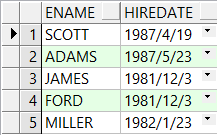

26. 显示出平均工资最高的的部门平均工资及部门名称

```
--第一步：先查出部门平均工资及名称
select avg(sal) avgSal,deptno from emp group by deptno;
--第二步：解题 
--方法一
select * from (select dname,avg(sal) avgsal from emp e,dept d where e.deptno = d.deptno group by dname)
where avgsal = (select max(avg(sal)) from emp group by deptno);

--方法二
select dname,avg(sal)  from emp e,dept d 
where e.deptno = d.deptno 
group by dname 
having avg(sal) =(select max(avg(sal)) from emp group by deptno);
```
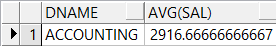

==================================================================
#### 分割线
==================================================================

**博主为咯学编程：父母不同意学编程，现已断绝关系;恋人不同意学编程，现已分手;亲戚不同意学编程，现已断绝来往;老板不同意学编程,现已失业三十年。。。。。。如果此博文有帮到你欢迎打赏，金额不限。。。**

